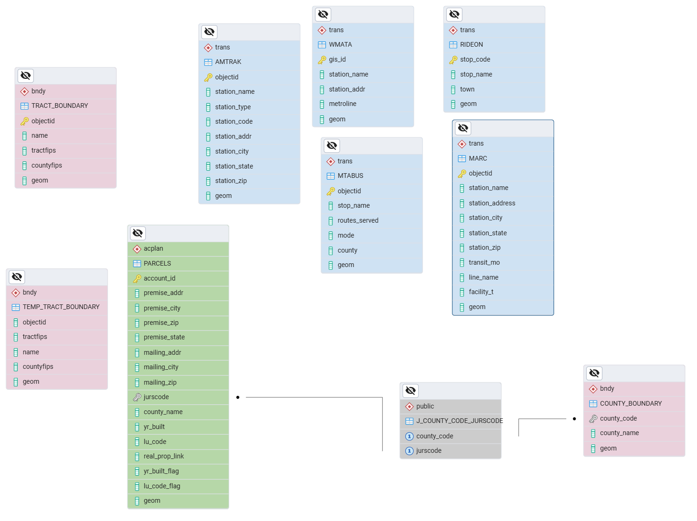

# Transit Accessibility of New Residential Development in Montgomery County, MD

This project evaluates transit accessibility for newly developed residential parcels (2020–present) in Montgomery County, Maryland.  
It integrates parcel, boundary, and transit datasets into a PostGIS database, applies ETL pipelines in R/Quarto, and uses spatial SQL queries to classify and analyze accessibility.

---

## Repository Contents

- **`access_database_creation.sql`** → Creates roles, schemas, domains, tables, views, and indexes in PostGIS.  
- **`queries.sql`** → Example analysis queries (new parcels, bus/train access, tract-level summaries).  
- **`parcels_finalproject_etl.qmd`** → ETL script for parcel data (cleaning, filtering for 2020+, spatial load into PostGIS).  
- **`transit_bndy.qmd`** → ETL script for boundaries and transit datasets (counties, tracts, MARC, AMTRAK, WMATA, RideOn, MTA).  
- **`/figures/`** → (Exported maps/images are placed here).  

---

## Objectives

- Identify new residential parcels (built ≥2020) in Montgomery County.  
- Integrate parcel + transit datasets into a spatially enabled PostgreSQL/PostGIS database.  
- Evaluate proximity of parcels to bus (500m) and rail (1mi, 5mi) services.  
- Classify parcels into access categories (bus access, rail access, no access).  
- Visualize spatial patterns to identify gaps in coverage.  

---

## Data Sources

- **Parcel Data** – Maryland Dept. of Planning (Property View, centroids)  
- **Transit Data** –  
  - RideOn (local)  
  - MTA Bus (regional)  
  - MARC (commuter rail)  
  - AMTRAK (national)  
  - WMATA (Metro)  
- **Boundaries** – County and Census Tracts (Maryland official datasets)  
- **CRS** – All data projected to EPSG:26985 (NAD83 / Maryland State Plane)  

---

## Workflow

1. **Database Creation**  
   - Run `access_database_creation.sql` in PostgreSQL.  
   - Schemas: `acplan` (parcels), `bndy` (boundaries), `trans` (transit).  
   - Views:  
     - `V_NEW_DEV` → new parcels since 2020  
     - `V_RESI_BUS_ACCESS` / `V_RESI_TRAIN_ACCESS`  
     - `V_RESI_NO_TRANSIT_ACCESS` / `V_NOTRAINSTATION_5MI`  
     - Tract-level summaries  

2. **ETL (Extract–Transform–Load)**  
   - `transit_bndy.qmd`: loads boundaries + transit layers → PostGIS.  
   - `parcels_finalproject_etl.qmd`: filters/cleans parcels → PostGIS.  

3. **Queries & Analysis**  
   - Run `queries.sql` for counts, summaries, and validation.
   - 
---
## Database Schema (ERD)

The Entity–Relationship Diagram (ERD) below illustrates the database structure,  
showing how parcels, boundaries, and transit datasets are organized in PostGIS  
and how they relate to each other.

---

## Results & Maps

### 1. New Residential Parcels (2020–present)  
Total parcels: 348,587  
New developments: 6,376  
Most clustered near Washington, D.C. border.  

---

### 2. Train Accessibility  
Train facilities in Montgomery County:  
- MARC: 11  
- AMTRAK: 1  
- WMATA: 11  

Only 1,274 (~20%) of new parcels are within 1 mile of a rail station.  

---

### 3. Bus Accessibility  
Bus facilities:  
- RideOn: 4,787 stops  
- MTA: 24 stops  

4,672 (~73%) of new parcels are within 500m of a bus stop.  

---

### 4. Parcels > 5 Miles from Rail  
457 parcels are beyond 5 miles of MARC/AMTRAK/WMATA stations.  

---

### 5. No Transit Access (Bus or Rail)  
1,653 parcels lack access to any transit service within defined thresholds.  

---

### 6. Tract-Level Patterns  
- Southern/Eastern tracts → high coverage  
- Northern/Western tracts → low coverage  

This map shows the percentage of new residential parcels with bus access by census tract in Montgomery County. Access is highest in the southern tracts, while many northern and western areas show limited or no bus coverage. White tracts indicate no new residential development.
Parcels with Bus Access: 4,672 Total New Developments: 6,376

This map displays the percentage of new residential parcels with train access by census tract in Montgomery County. Most tracts show low access (0–20%, light yellow), while higher access (60–100%, dark green) is concentrated along WMATA and MARC corridors in the eastern and southern regions. Western and northern tracts lack access due to limited station coverage.
Parcels with Train Access: 1,274Total New Developments: 6,376

---

## Findings

- Built a normalized PostGIS DB with roles, indexing, and views.  
- Identified 6,376 new parcels (2020+).  
- Train access: 20%, Bus access: 73%, No access: 1,653 parcels.  
- Equity gap: Southern/Eastern tracts well served; Northern/Western underserved.  
- Supports data-driven planning for transit investment.  

---

## Skills & Tools

- PostgreSQL/PostGIS – schema design, spatial queries, role-based access.  
- R + Quarto – ETL pipelines from ArcGIS services to PostGIS.  
- SQL views – classification & aggregation of accessibility.  
- GIS visualization – maps highlighting spatial gaps.  

---

## Conclusion
- Built a normalized spatial PostGIS database with well-organized schemas, role control, and validation rules.
- Identified 6,376 new residential parcels developed since 2020 in Montgomery County.
- Found that only 1,274 (≈20%) of these have access to train stations within 1 mile.
- Bus access is more widespread , 4,672 parcels (~73%) are within 500m of a stop.
- 1,653 parcels had no transit access (bus or train) within defined thresholds.
- Spatial patterns show higher access in southern and eastern tracts and lower access in the north and west.
- Created tract-level views to support equity-focused transit planning.
- Gained experience in ETL, spatial indexing, role-based access, and spatial SQL for real-world urban planning use.

